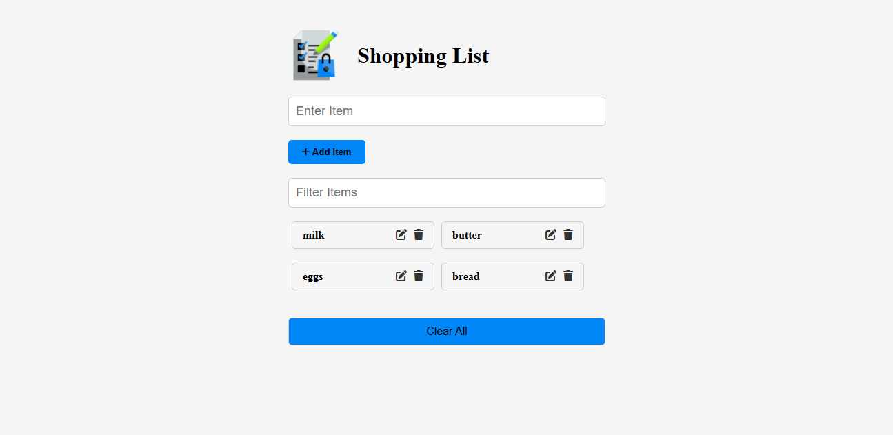

# Shopping List App

This is a simple shopping list application built with Vanilla JavaScript. It allows users to add, update, and delete items from the list. The application uses local storage, so the list remains available even after a page refresh.

## App Interface



## Features

- Add new items to the list
- Update existing items
- Delete items from the list
- Persist the list in local storage for availability across sessions

## How to Use

1. Enter the name of the item in the input field.
2. Click the 'Add' button to add the item to the list.
3. To update an item, click on the item name, modify it, and press 'Enter'.
4. To delete an item, click the 'Delete' button next to the item.

## Project Setup

No special setup is required. Just clone the repository and open `index.html` in your browser.

```bash
git clone <https://github.com/Umairulislam/Shopping-List-Project.git>
cd <Shopping-List-Project>
open index.html
```

## Technologies Used

- HTML
- CSS
- JavaScript
- Bootstrap
